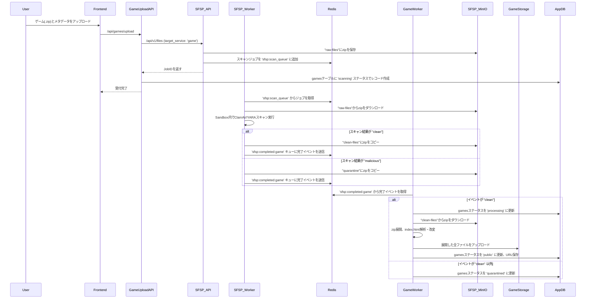

# Atomosidea 完全ガイド & 技術仕様書

Atomosidea（アトモシデア）は、動画共有・ゲーム配信・静的サイトホスティング・プロフィール機能を統合した多機能なデジタルコンテンツプラットフォームです。マイクロサービスアーキテクチャを採用しており、各機能が独立したサービスとして開発・運用されます。これにより高いスケーラビリティ、可用性、メンテナンス性を実現しています。

## 目次

- [1. プロジェクト概要・背景・解決する課題](#1-プロジェクト概要背景解決する課題)
  - [プロジェクトの目的と概要](#プロジェクトの目的と概要)
  - [解決しているビジネス・技術的課題](#解決しているビジネス技術的課題)
  - [コア価値と主なターゲットユーザー](#コア価値と主なターゲットユーザー)
- [2. 厳密な機能カタログ（全機能網羅）](#2-厳密な機能カタログ全機能網羅)
- [3. アーキテクチャと技術スタック](#3-アーキテクチャと技術スタック)
  - [システム全体のアーキテクチャ概要](#システム全体のアーキテクチャ概要)
  - [使用技術・ライブラリとその選定理由・役割一覧](#使用技術ライブラリとその選定理由役割一覧)
  - [docker-compose と実装の対応関係](#docker-compose-と実装の対応関係)
  - [データフロー・処理シーケンス（ゲームアップロードの例）](#データフロー処理シーケンスゲームアップロードの例)
- [4. ディレクトリ構造と全ファイル解説](#4-ディレクトリ構造と全ファイル解説)
- [5. データ構造・型定義・API仕様](#5-データ構造型定義api仕様)
  - [主要なDBスキーマ](#主要なdbスキーマ)
  - [APIエンドポイント仕様](#apiエンドポイント仕様)
- [6. セットアップ・環境構築・開発手順](#6-セットアップ環境構築開発手順)
  - [6.1. 前提要件](#61-前提要件)
  - [6.2. 環境変数の設定](#62-環境変数の設定)
  - [6.3. スクリプトと開発タスク](#63-スクリプトと開発タスク)
  - [6.4. 起動手順](#64-起動手順)
- [7. デプロイ・運用・トラブルシューティング](#7-デプロイ運用トラブルシューティング)
  - [CI/CD](#cicd)
  - [トラブルシューティング](#トラブルシューティング)
- [8. コントリビューション・開発規約](#8-コントリビューション開発規約)
  - [ブランチ戦略](#ブランチ戦略)
  - [コミット規約](#コミット規約)
  - [コードスタイル](#コードスタイル)

---

## 1. プロジェクト概要・背景・解決する課題

### プロジェクトの目的と概要

Atomosidea は、動画共有・ゲーム配信・静的サイトホスティング・プロフィール機能などを統合した多機能なコンテンツプラットフォームです。マイクロサービスアーキテクチャを採用しており、各機能が独立したサービスとして開発・運用されています。これにより、高いスケーラビリティ、可用性、メンテナンス性を実現しています。

### 解決しているビジネス・技術的課題

- **多様なコンテンツの一元管理:** ユーザーは動画、ゲーム、ウェブサイトなど、さまざまな形式のコンテンツを1つのプラットフォームで公開・管理できます。
- **スケーラブルなインフラ:** 各サービスが独立しているため、特定の機能（例: 動画ストリーミング）への負荷が高まった場合でも、そのサービスだけをスケールアウトさせることができます。
- **セキュリティの確保:** アップロードされるすべてのファイルは、専用のセキュリティサービス（SFSP）によってスキャンされ、マルウェアや不正なファイルからプラットフォームを保護します。
- **開発効率の向上:** マクロサービス（マイクロサービス）アーキテクチャにより、チームは各サービスを並行して開発でき、デプロイもサービス単位で迅速に行うことができます。

### コア価値と主なターゲットユーザー

- **コア価値:**
  - クリエイターが多様なデジタルコンテンツを安全かつ簡単に配信できる環境を提供する。
  - ユーザーがさまざまなエンターテイメントコンテンツをシームレスに楽しめる体験を提供する。
- **ターゲットユーザー:**
  - **コンテンツクリエイター:** 動画制作者、ゲーム開発者、ウェブデザイナーなど。
  - **一般ユーザー:** 動画の視聴、ゲームのプレイ、ウェブサイトの閲覧を楽しむユーザー。

---

## 2. 厳密な機能カタログ（全機能網羅）

### ユーザー認証 (auth-service)

- **機能概要:** ユーザーの登録、ログイン、ログアウト、アカウント削除を管理。ローカル認証（管理者のみ）とGoogle OAuth2認証を提供。
- **トリガー:**
  - `/api/auth/register`: 管理者コードを用いたローカル管理者アカウントの作成。
  - `/api/auth/login`: ローカルアカウントでのログイン。
  - `/api/auth/google/login`: Google OAuth2認証フローの開始。
  - `/api/auth/google/callback`: Googleからのコールバックを受け取り、ユーザー登録またはログイン処理。
  - `/api/auth/logout`: JWTを無効化しログアウト。
  - `/api/auth/me`: 認証済みユーザー自身のプロフィールを取得。
- **内部処理ロジック:**
  - JWT (JSON Web Token) を発行し、セッション管理を行う。
  - ログアウト時にはRedisのブロックリストにJWTを追加し、トークンを無効化。
  - Google認証成功時、`profile-service`を呼び出して初期プロフィールを作成。
  - アカウント削除時、関連する全サービス（`app-db`、`profile-storage`、`game-storage`、`static-site-storage`）からユーザーデータを削除する。
- **関連ファイル:** `backend/auth/auth-worker/auth-service/main.go`
- **Dockerfile:** `backend/auth/auth-worker/auth-service/Dockerfile`

### プロフィール管理 (profile-service)

- **機能概要:** ユーザーのプロフィール情報（ユーザー名、自己紹介、アイコン、背景画像）を管理。アイコン・背景画像のアップロードはSFSPを介してセキュリティスキャンを実施します。
- **トリガー:**
  - `/api/profile/me`: 認証済みユーザー自身のプロフィールを取得。
  - `/api/profile/:userId`: 特定ユーザーのプロフィールを取得。
  - `/api/profile`: プロフィール情報（ユーザー名、自己紹介）を更新。
  - `/api/profile/icon`、`/api/profile/background`: アイコンと背景画像をアップロードし、SFSPでスキャン後に反映。
  - `/api/profile/internal/create`: `auth-service`からの内部呼び出しで初期プロフィールを作成。
- **内部処理ロジック:**
  - プロフィール情報は`profile-db`の`users`テーブルに保存。
  - 画像アップロード時、`sfsp-api`にファイルを転送し、ClamAV/YARAスキャンを実施。
  - スキャン完了後、`sfsp:completed:profile`キューを介して完了イベントを受け取る。
  - スキャン結果が`clean`の場合、SFSP Clean MinIOから画像をダウンロードし、`profile-storage`（MinIO）に保存後、DBのURLを更新。
  - 変更前の画像は、新しい画像の反映時にMinIOから削除される。
  - フロントエンドはスキャン中、ローカルプレビューを表示し、ポーリングで完了を検知する。
- **関連ファイル:** `backend/auth/auth-worker/profile-service/main.go`
- **Dockerfile:** `backend/auth/auth-worker/profile-service/Dockerfile`

> **補足:** プロフィールのスキャン処理は `profile-service` 自身が担当します。`profile-worker` という独立したサービスは存在しません（`docker-compose.yml` にも定義なし）。

### 動画アップロード (video-upload-api)

- **機能概要:** 動画ファイルのアップロードと処理パイプラインを管理。
- **トリガー:** `/api/videos/upload`: 動画ファイルとメタデータ（タイトル、説明）をアップロード。
- **内部処理ロジック:**
  1. アップロードされた動画を`sfsp-api`に転送し、セキュリティスキャンを依頼。
  2. `app-db`の`videos`テーブルに`scanning`ステータスでレコードを作成。
  3. `video-worker`がRedisキュー経由でスキャン完了イベントを待つ。
- **MinIOアップロードのリトライ:** 動画変換後のHLSとサムネイルをMinIOへアップロードする際、起動時の競合（video-storageのMinIOが未準備等情况）で一時的に失敗しても自動的にリトライします（最大5回、バックオフ付き）。各試行前にファイルリーダーを巻き戻すため、本質的な設定エラーでない限り解決します。
- **関連ファイル:** `backend/video-service/video-upload-api/main.go`
- **Dockerfile:** `backend/video-service/video-upload-api/Dockerfile`

### 動画処理 (video-worker)

- **機能概要:** スキャン済みの動画をHLS形式に変換し、公開準備を整える。独立したバックエンドワーカーサービス。
- **トリガー:** Redisの`sfsp:completed:stream`に`ScanCompletionEvent`が追加されること。
- **内部処理ロジック:**
  1. `"clean"`ステータスのイベントを受け取ると、`sfsp-clean-minio`から安全な動画ファイルをダウンロード。
  2. FFmpegを使い、動画を複数の解像度（360p、480p、720p、1080p）のHLSストリームに変換。
  3. FFmpegで動画からサムネイルを生成。
  4. 変換されたHLSファイル群とサムネイルを`video-storage`（MinIO、バケット: `videos`）に保存。
  5. `app-db`の`videos`テーブルのステータスを`public`に更新し、HLSプレイリストとサムネイルのパスを保存。
- **ローカル作業ディレクトリ（`upload_workdir`）:** 動画のダウンロード・HLS変換・サムネイル生成にはローカル作業領域を使用します。`docker-compose.yml` で `./backend/video-service/upload_workdir` を `video-upload-api` は読み書き用、`video-worker` は読み取り専用で `/storage` へマウントします。処理完了後にHLSをMinIOへ展開し、ローカルの一時ファイルは削除されます。データはMinIOに永続化されるため、このディレクトリの一時内容は失われても自動再生成され、動作に影響しません。
- **関連ファイル:** `backend/video-service/video-worker/main.go`
- **Dockerfile:** `backend/video-service/video-worker/Dockerfile`

### 動画ストリーミング (video-worker)

- **機能概要:** 動画のメタデータを提供し、フロントエンドでストリーミング再生を実現。
- **トリガー:**
  - `/api/videos`: 公開中の動画リストを取得。
  - `/api/videos/:id`: 特定の動画の詳細情報を取得。
- **内部処理ロジック:**
  - `video-worker`は`app-db`から動画のメタデータ（タイトル、HLSプレイリストのパス等）を提供する。
  - `frontend`のNginxが`video_storage_data`ボリュームを直接マウントし、HLSファイル（`.m3u8`、`.ts`）を配信する。`video-worker`はファイル配信には関与しない。
- **関連ファイル:** `backend/video-service/video-worker/main.go`（video-worker と同一ビルド）
- **Dockerfile:** `backend/video-service/video-worker/Dockerfile`

### ゲームアップロード (game-upload-api)

- **機能概要:** WebGLビルドのゲーム（.zip）のアップロードと管理。
- **トリガー:** `/api/games/upload`: ゲームのzipファイル、サムネイル、メタデータをアップロード。
- **内部処理ロジック:**
  1. `sfsp-api`にzipファイルを転送し、セキュリティスキャンを依頼。
  2. `app-db`の`games`テーブルに`scanning`ステータスでレコードを作成。
  3. `game-worker`がRedisキュー経由でスキャン完了イベントを待つ。
- **関連ファイル:** `backend/game-service/game-upload-api/main.go`
- **Dockerfile:** `backend/game-service/game-upload-api/Dockerfile`

### ゲーム処理 (game-worker)

- **機能概要:** スキャン済みのゲームzipファイルを展開し、MinIOにデプロイする。独立したバックエンドワーカーサービス。
- **トリガー:** Redisの`sfsp:completed:game`に`ScanCompletionEvent`が追加されること。
- **内部処理ロジック:**
  1. `"clean"`ステータスのイベントを受け取ると、`sfsp-minio`からzipファイルをダウンロード。
  2. zipファイルを展開し、`index.html`を探索してゲームのルートディレクトリを特定。
  3. `index.html`を解析してゲームのネイティブ解像度を抽出し、表示を最適化するCSSを注入。
  4. 展開した全ファイルを`game-storage`（MinIO）にアップロード。
  5. `app-db`の`games`テーブルのステータスを`public`に更新し、ゲームURLと解像度を保存。
- **関連ファイル:** `backend/game-service/game-worker/main.go`
- **Dockerfile:** `backend/game-service/game-worker/Dockerfile`

### 静的サイトアップロード (static-site-upload-api)

- **機能概要:** 静的サイト（.zip）のアップロードと管理。
- **トリガー:** `/api/static-sites/upload`: 静的サイトのzipファイル、サムネイル、メタデータをアップロード。
- **内部処理ロジック:**
  1. `sfsp-api`にzipファイルを転送し、セキュリティスキャンを依頼。
  2. `app-db`の`static_sites`テーブルに`scanning`ステータスでレコードを作成。
  3. `static-site-worker`がRedisキュー経由でスキャン完了イベントを待つ。
- **関連ファイル:** `backend/static-site-service/static-site-upload-api/main.go`
- **Dockerfile:** `backend/static-site-service/static-site-upload-api/Dockerfile`

### 静的サイト処理 (static-site-worker)

- **機能概要:** スキャン済みの静的サイトzipファイルを展開し、MinIOにデプロイする。独立したバックエンドワーカーサービス。
- **トリガー:** Redisの`sfsp:completed:static-site`に`ScanCompletionEvent`が追加されること。
- **内部処理ロジック:**
  1. `"clean"`ステータスのイベントを受け取ると、`sfsp-minio`からzipファイルをダウンロード。
  2. zipファイルをメモリ内で読み込み、`index.html`を基準にルートを特定。
  3. zip内の全ファイルを`static-site-storage`（MinIO）に直接アップロード。
  4. `app-db`の`static_sites`テーブルのステータスを`public`に更新。
- **関連ファイル:** `backend/static-site-service/static-site-worker/main.go`
- **Dockerfile:** `backend/static-site-service/static-site-worker/Dockerfile`

### マイページ (mypage-service)

- **機能概要:** 認証済みユーザーがアップロードしたコンテンツの一覧を提供。
- **トリガー:**
  - `/api/my/videos`: 自身の動画一覧を取得。
  - `/api/my/games`: 自身のゲーム一覧を取得。
  - `/api/my/static-sites`: 自身の静的サイト一覧を取得。
- **内部処理ロジック:** `app-db`から`uploader_id`または`user_id`が認証ユーザーと一致するコンテンツを検索して返す。
- **関連ファイル:** `backend/auth/mypage-worker/main.go`
- **Dockerfile:** `backend/auth/mypage-worker/Dockerfile`

### セキュリティスキャン受付 (sfsp-api)

- **機能概要:** 各アップロードサービスからのファイルを受け付け、スキャンジョブをキューイングする。
- **トリガー:** `/api/v1/files`: ファイルと`target_service`を受け取る。
- **内部処理ロジック:**
  1. ファイルのSHA256ハッシュを計算し、`sfsp-db`で重複チェック。
  2. 重複がなければ、ファイルを`sfsp-raw-minio`の`raw-files`バケットに保存し、`files`テーブルにレコードを作成。
  3. `scan_jobs`テーブルにジョブレコードを作成し、ジョブIDをRedisの`sfsp:scan_queue`にエンキューする。
- **関連ファイル:** `backend/security/sfsp/cmd/sfsp-api/main.go`、`backend/security/sfsp/internal/api/handlers.go`
- **Dockerfile:** `backend/security/sfsp/docker/api/Dockerfile`

### セキュリティスキャン実行 (sfsp-worker)

- **機能概要:** Redisキューからジョブを取得し、ファイルのスキャンを実行する。
- **トリガー:** Redisの`sfsp:scan_queue`にジョブIDが追加されること。
- **内部処理ロジック:**
  1. `sfsp-raw-minio`の`raw-files`から対象ファイルをダウンロード。
  2. zipファイルの場合は展開し、コンテンツのルートを特定。
  3. Docker Sandbox内でClamAVとYARAをコンテナとして実行し、ファイルをスキャン。
  4. スキャン結果を`scan_results`テーブルに保存。
  5. 総合結果に基づき、ファイルを`clean-files`または`quarantine`バケットにコピーし、`raw-files`から削除。
  6. 最終結果を`ScanCompletionEvent`として、対象サービス（`stream`、`game`、`static-site`、`profile`）ごとのRedisキューに発行する。
- **関連ファイル:** `backend/security/sfsp/cmd/sfsp-worker/main.go`、`backend/security/sfsp/internal/worker/worker.go`
- **Dockerfile:** `backend/security/sfsp/docker/worker/Dockerfile`

> **補足:** sfsp-worker は `deploy.resources.limits.memory: 2g` を設定されており、Dockerソケット・YARAルール・スキャン用ボリュームにアクセスします。

### シシステム監視 (monitoring-service)

- **機能概要:** 開発者向けの運用・監視ダッシュボード。プロジェクト全体のマイクロサービスの稼働状況、リソース使用率、ログなどをリアルタイムで可視化する。
- **主な機能:**
  - **システムマップ:** 全コンテナを機能（UI、API、Worker等）ごとに階層化して自動レイアウトし、サービス間の連携を視覚的に表示。
  - **リアルタイム監視:** 各コンテナのCPU・メモリ使用率、稼働状態、ログの流量（LPS）、エラー発生状況をリアルタイムに更新。
  - **統合ダッシュボード:** システム全体の負荷、アクティブユーザー数（推定）などを集約して表示。
  - **インタラクティブ操作:**
    - **ログストリーミング:** コンテナのノードをクリックすると、リアルタイムでログを閲覧できる。
    - **コンテナ再起動:** ダッシュボード上から特定のコンテナを再起動する機能。
    - **ストレージブラウザ:** MinIOコンテナのノードからは、バケットやオブジェクトをGUIで直接閲覧・アップロード・削除できる。
- **アクセス:** `http://localhost:8090`
- **関連ディレクトリ:** `monitoring-service/`
- **起動:** `monitoring-service` ディレクトリ内で `docker-compose -f docker-compose.monitoring.yml up -d --build`

---

## 3. アーキテクチャと技術スタック

### システム全体のアーキテクチャ概要

Atomosidea は、Docker Composeによって管理されるマイクロサービス群で構成されています。各サービスは独立したコンテナとして動作し、APIやメッセージキューを介して連携します。

```mermaid
graph TD
    subgraph "User Facing"
        Frontend(Frontend - React/Vite/TypeScript)
    end

    subgraph "Developer Facing"
        MonitoringService(Monitoring Service)
    end

    subgraph "API Services"
        AuthService(Auth Service)
        ProfileService(Profile Service)
        UploadService(Upload Service)
        StreamService(Stream Service)
        GameUploadAPI(Game Upload API)
        StaticSiteUploadAPI(Static Site API)
        MyPageService(MyPage Service)
    end

    subgraph "Backend Workers"
        VideoWorker(Video Worker)
        GameWorker(Game Worker)
        StaticSiteWorker(Static Site Worker)
    end

    subgraph "Security Services (SFSP)"
        SFSP_API(SFSP API)
        SFSP_Worker(SFSP Worker)
    end

    subgraph "Databases"
        AuthDB[(Auth DB - PostgreSQL)]
        AppDB[(App DB - PostgreSQL)]
        ProfileDB[(Profile DB - PostgreSQL)]
        TeamDB[(Team DB - PostgreSQL)]
        SFSP_DB[(SFSP DB - PostgreSQL)]
        Redis[(Redis - Cache & Queue)]
    end

    subgraph "Storage (MinIO)"
        ProfileStorage([Profile Storage])
        GameStorage([Game Storage])
        StaticSiteStorage([Static Site Storage])
        VideoStorage([Video Storage - Local Volume])
        SFSP_MinIO([SFSP Storage])
    end

    Frontend -->|REST API| AuthService
    Frontend -->|REST API| ProfileService
    Frontend -->|REST API| UploadService
    Frontend -->|REST API| StreamService
    Frontend -->|REST API| GameUploadAPI
    Frontend -->|REST API| StaticSiteUploadAPI
    Frontend -->|REST API| MyPageService

    AuthService --> AuthDB
    AuthService --> AppDB
    AuthService --> ProfileDB
    AuthService --> Redis
    AuthService --> ProfileStorage
    AuthService --> GameStorage
    AuthService --> StaticSiteStorage
    AuthService -->|HTTP Call| ProfileService

    ProfileService --> ProfileDB
    ProfileService --> ProfileStorage
    ProfileService -->|HTTP Call| SFSP_API
    ProfileService --> Redis

    UploadService --> AppDB
    UploadService --> Redis
    UploadService -->|HTTP Call| SFSP_API
    UploadService --> VideoStorage

    StreamService --> AppDB

    GameUploadAPI --> AppDB
    GameUploadAPI --> Redis
    GameUploadAPI --> GameStorage
    GameUploadAPI -->|HTTP Call| SFSP_API

    StaticSiteUploadAPI --> AppDB
    StaticSiteUploadAPI --> Redis
    StaticSiteUploadAPI --> StaticSiteStorage
    StaticSiteUploadAPI -->|HTTP Call| SFSP_API

    MyPageService --> AuthDB
    MyPageService --> AppDB

    SFSP_API --> SFSP_DB
    SFSP_API --> SFSP_MinIO
    SFSP_API -->|Enqueue Job| Redis

    SFSP_Worker -->|Dequeue Job| Redis
    SFSP_Worker --> SFSP_DB
    SFSP_Worker --> SFSP_MinIO
    SFSP_Worker -->|Enqueue Event| Redis

    VideoWorker -->|Dequeue Event| Redis
    VideoWorker --> AppDB
    VideoWorker --> SFSP_MinIO
    VideoWorker --> VideoStorage

    GameWorker -->|Dequeue Event| Redis
    GameWorker --> AppDB
    GameWorker --> SFSP_MinIO
    GameWorker --> GameStorage

    StaticSiteWorker -->|Dequeue Event| Redis
    StaticSiteWorker --> AppDB
    StaticSiteWorker --> SFSP_MinIO
    StaticSiteWorker --> StaticSiteStorage

    MonitoringService -->|Docker Socket| AuthService
    MonitoringService -->|Docker Socket| ProfileService
    MonitoringService -->|Docker Socket| UploadService
    MonitoringService -->|Docker Socket| StreamService
    MonitoringService -->|Docker Socket| GameUploadAPI
    MonitoringService -->|Docker Socket| StaticSiteUploadAPI
    MonitoringService -->|Docker Socket| MyPageService
    MonitoringService -->|Docker Socket| VideoWorker
    MonitoringService -->|Docker Socket| GameWorker
    MonitoringService -->|Docker Socket| StaticSiteWorker
    MonitoringService -->|Docker Socket| SFSP_API
    MonitoringService -->|Docker Socket| SFSP_Worker
    MonitoringService -->|Docker Socket| AuthDB
    MonitoringService -->|Docker Socket| AppDB
    MonitoringService -->|Docker Socket| ProfileDB
    MonitoringService -->|Docker Socket| SFSP_DB
    MonitoringService -->|Docker Socket| Redis
    MonitoringService -->|Docker Socket| ProfileStorage
    MonitoringService -->|Docker Socket| GameStorage
    MonitoringService -->|Docker Socket| StaticSiteStorage
    MonitoringService -->|Docker Socket| VideoStorage
    MonitoringService -->|Docker Socket| SFSP_MinIO
```



### 使用技術・ライブラリとその選定理由・役割一覧

| カテゴリ | 技術・ライブラリ | 選定理由・役割 |
|---|---|---|
| **フロントエンド** | React, Vite, TypeScript | モダンで高速なUI開発を実現。型安全なコードで大規模開発にも対応。 |
| | MUI (@mui/material, @mui/icons-material) | 高品質なUIコンポーネントやアイコンを迅速に構築するため。 |
| | Axios | HTTPリクエストを簡単かつ堅牢に処理するため。 |
| | React Router DOM | シングルページアプリケーション（SPA）のルーティングを管理するため。 |
| | hls.js | HLS（HTTP Live Streaming）動画をブラウザで再生するため。 |
| | jwt-decode | JWTをデコードしてユーザー情報を取得するため。 |
| | react-image-crop | アイコン・背景画像のクロップ（切り抜き）のため。 |
| **バックエンド** | Go (GoLang) | 高性能・並行処理能力、静的型付けによる堅牢性を評価。マイクロサービスに適している。 |
| | Gin, Gorilla Mux | Go言語で高速なHTTPルーターとミドルウェアを提供。API開発を効率化。 |
| **データベース** | PostgreSQL | 高機能で信頼性の高いリレーショナルデータベース。トランザクションの整合性を保証。 |
| | Redis | 高速なインメモリデータストア。キャッシュ（JWTブロックリスト）やメッセージキュー（スキャンジョブ/完了イベント）として利用し、システムの応答性を向上。 |
| **ストレージ** | MinIO | S3互換のオブジェクトストレージ。大量の非構造化データ（動画、画像、ゲームファイル等）をスケーラブルに管理。 |
| **コンテナ** | Docker, Docker Compose | 開発環境と本番環境の差異をなくし、ポータビリティと再現性を確保。マイクロサービス群を統合管理。 |
| **セキュリティ** | ClamAV, YARA | オープンソースのアンチウイルスエンジンとマルウェア検出ツール。アップロードファイルのセキュリティを確保。Docker Sandbox内で実行し、安全性を高めている。 |
| **動画処理** | FFmpeg | 動画・音声のエンコード、デコード、変換を行うための強力なライブラリ。HLSへの変換に使用。 |

### docker-compose と実装の対応関係

`docker-compose.yml` で定義される各サービスのビルド元（`Dockerfile`）と実装ディレクトリは以下の通りです。

| サービス名 | コンテナ名 | ビルド元（Dockerfile） | 実装ディレクトリ |
|---|---|---|---|
| `frontend` | `atmosidea-frontend` | `./frontend`（Nginxで配信） | `frontend/` |
| `auth-service` | `atmosidea-auth-service` | `backend/auth/auth-worker/auth-service/Dockerfile` | `backend/auth/auth-worker/auth-service/` |
| `profile-service` | `atmosidea-profile-service` | `backend/auth/auth-worker/profile-service/Dockerfile` | `backend/auth/auth-worker/profile-service/` |
| `video-upload-api` | `atmosidea-video-upload-api` | `backend/video-service/video-upload-api/Dockerfile` | `backend/video-service/video-upload-api/` |
| `video-worker` | `atmosidea-video-worker` | `backend/video-service/video-worker/Dockerfile` | `backend/video-service/video-worker/` |
| `game-upload-api` | `atmosidea-game-upload-api` | `backend/game-service/game-upload-api/Dockerfile` | `backend/game-service/game-upload-api/` |
| `game-worker` | `atmosidea-game-worker` | `backend/game-service/game-worker/Dockerfile` | `backend/game-service/game-worker/` |
| `static-site-upload-api` | `atmosidea-static-site-upload-api` | `backend/static-site-service/static-site-upload-api/Dockerfile` | `backend/static-site-service/static-site-upload-api/` |
| `static-site-worker` | `atmosidea-static-site-worker` | `backend/static-site-service/static-site-worker/Dockerfile` | `backend/static-site-service/static-site-worker/` |
| `mypage-service` | `atmosidea-mypage-service` | `backend/auth/mypage-worker/Dockerfile` | `backend/auth/mypage-worker/` |
| `team-service` | `atmosidea-team-service` | `backend/team-service/team-worker/Dockerfile` | `backend/team-service/team-worker/` |
| `sfsp-api` | `sfsp-api` | `backend/security/sfsp/docker/api/Dockerfile` | `backend/security/sfsp/` |
| `sfsp-worker` | `sfsp-worker` | `backend/security/sfsp/docker/worker/Dockerfile` | `backend/security/sfsp/` |
| `sfsp-clamav-client` | `sfsp-clamav-client-builder` | `backend/security/sfsp/docker/clamav-client/Dockerfile` | `backend/security/sfsp/` |
| `sfsp-yara-client` | `sfsp-yara-client-builder` | `backend/security/sfsp/docker/yara-client/Dockerfile` | `backend/security/sfsp/` |

> **補足:** `video-worker` と `video-worker` は同じDockerfileからビルドされますが、別々のコンテナとして動作します。

### データフロー・処理シーケンス（ゲームアップロードの例）



---

## 4. ディレクトリ構造と全ファイル解説

```
.
├── backend/                     # Goバックエンドサービス群
│   ├── auth/
│   │   ├── auth-datebase/       # DB関連（auth-db初期スクリプト）。下位にauth-db/とprofile-db/が共存
│   │   │   └── auth-db/init.sql
│   │   ├── profile-db/          # profile-dbスクリプト
│   │   │   └── init.sql
│   │   ├── auth-storage/        # MinIO永続化
│   │   │   └── profile_storage_data/
│   │   ├── auth-worker/         # ワーカー・サービス
│   │   │   ├── auth-service/    #   認証サービス
│   │   │   │   ├── Dockerfile
│   │   │   │   ├── go.mod
│   │   │   │   ├── go.sum
│   │   │   │   └── main.go
│   │   │   └── profile-service/ #   プロフィールサービス
│   │   │       ├── Dockerfile
│   │   │       ├── go.mod
│   │   │       ├── go.sum
│   │   │       └── main.go
│   │   └── mypage-worker/       # マイページサービス
│   │       ├── Dockerfile
│   │       ├── go.mod
│   │       ├── go.sum
│   │       └── main.go
│   ├── game-service/
│   │   ├── game-upload-api/     # ゲームアップロードAPI
│   │   │   ├── Dockerfile
│   │   │   ├── go.mod
│   │   │   ├── go.sum
│   │   │   └── main.go
│   │   ├── game-worker/         # ゲーム処理ワーカー
│   │   │   ├── Dockerfile
│   │   │   ├── go.mod
│   │   │   ├── go.sum
│   │   │   └── main.go
│   │   └── game_storage_data/   # ゲームMinIOデータ（バケット: games）。本文ではgame-storage/と記載するが実ディレクトリ名はgame_storage_data/
│   ├── static-site-service/
│   │   ├── static-site-upload-api/
│   │   │   ├── Dockerfile
│   │   │   ├── go.mod
│   │   │   ├── go.sum
│   │   │   └── main.go
│   │   ├── static-site-worker/
│   │   │   ├── Dockerfile
│   │   │   ├── go.mod
│   │   │   ├── go.sum
│   │   │   └── main.go
│   │   ├── static_site_storage_data/  # MinIOデータ（バケット: static-sites）
│   │   └── static_site_storage_db/    # 旧・DeprecatedのDB
│   ├── video-service/
│   │   ├── video-upload-api/
│   │   │   ├── Dockerfile
│   │   │   ├── go.mod
│   │   │   ├── go.sum
│   │   │   └── main.go
│   │   ├── video-worker/        # 動画処理ワーカー＋ストリーミングAPI（同一ビルド）
│   │   │   ├── Dockerfile
│   │   │   ├── go.mod
│   │   │   ├── go.sum
│   │   │   └── main.go
│   │   ├── video_storage_data/  # 動画MinIOデータ（バケット: videos, thumbnails）
│   │   └── upload_workdir/      # ローカル作業ボリューム（/storageへマウント。動画DL・HLS変換・サムネイル生成の一時領域）
│   ├── security/
│   │   └── sfsp/                # セキュリティサービス (SFSP)
│   │       ├── cmd/
│   │       │   ├── sfsp-api/
│   │       │   │   └── main.go
│   │       │   └── sfsp-worker/
│   │       │       └── main.go
│   │       ├── internal/
│   │       │   ├── api/
│   │       │   │   └── handlers.go
│   │       │   ├── config/
│   │       │   │   └── config.go
│   │       │   ├── database/
│   │       │   │   └── postgres.go
│   │       │   ├── model/
│   │       │   │   └── model.go
│   │       │   ├── queue/
│   │       │   │   └── redis.go
│   │       │   ├── sandbox/
│   │       │   │   ├── docker.go
│   │       │   │   └── sandbox.go
│   │       │   ├── scanner/
│   │       │   │   ├── clamav.go
│   │       │   │   ├── scanner.go
│   │       │   │   └── yara.go
│   │       │   ├── storage/
│   │       │   │   └── minio.go
│   │       │   └── worker/
│   │       │       └── worker.go
│   │       ├── docker/
│   │       │   ├── api/
│   │       │   │   └── Dockerfile
│   │       │   ├── worker/
│   │       │   │   └── Dockerfile
│   │       │   ├── clamav-client/
│   │       │   │   └── Dockerfile
│   │       │   └── yara-client/
│   │       │       └── Dockerfile
│   │       ├── yara-rules/
│   │       │   └── general.yar
│   │       ├── docs/            # ADR.md, Runbook.md, Threat_Model.md, Incident_Guide.md
│   │       ├── reports/
│   │       ├── scripts/
│   │       ├── scanners/
│   │       ├── test-samples/
│   │       ├── sfsp-db/         # SFSP用DBスキーマ（001_sfsp_initial_schema.sql）
│   │       └── sfsp-storage/    # SFSP用MinIOデータ（raw-files, clean-files, quarantine）
│   └── shared/                  # サービス間共有コード
│       ├── go.mod
│       ├── go.sum
│       ├── config/
│       │   └── config.go
│       ├── event/
│       │   └── event.go         # ScanCompletionEvent定義
│       ├── model/
│       │   └── model.go
│       └── queue/
│           └── queue.go         # キュー名定義（sfsp:scan_queue, sfsp:completed:*）
├── frontend/                    # フロントエンド (React/Vite/TypeScript)
│   ├── src/
│   │   ├── App.tsx
│   │   ├── main.tsx
│   │   ├── index.css
│   │   ├── theme.ts
│   │   ├── components/          # Header, PrivateRoute, ImageCropperModal, AccountDeletionModal
│   │   ├── context/             # AuthContext
│   │   └── pages/               # HomePage, LoginPage, RegisterPage, MyPage, VideoDetailPage, GameDetailPage, StaticSiteDetailPage, UploadPage, UploadGamePage, UploadStaticSitePage, EditVideoPage, EditGamePage, EditStaticSitePage, EditProfilePage, AdjustGamePage, LoginSuccessPage
│   ├── nginx.conf               # HLS配信も担うNginx設定
│   ├── index.html
│   ├── package.json
│   ├── tsconfig.json
│   └── vite.config.ts
├── monitoring-service/          # 運用・監視ダッシュボード
│   ├── backend/
│   ├── frontend/
│   ├── docker-compose.monitoring.yml
│   └── nginx.conf
├── minio-init/                  # MinIO初期化スクリプト/ポリシー
│   ├── initialize.sh
│   ├── sfsp-upload-policy.json
│   ├── sfsp-api-policy.json
│   ├── sfsp-game-worker-policy.json
│   ├── sfsp-video-worker-policy.json
│   ├── sfsp-static-site-worker-policy.json
│   ├── sfsp-profile-worker-policy.json
│   ├── sfsp-worker-raw-policy.json
│   ├── sfsp-worker-clean-policy.json
│   └── sfsp-worker-policy.json
├── test_field/                  # テスト用アップロードファイル置き場
├── docker-compose.yml           # 全サービスの構成定義
├── .env.example                 # 環境変数テンプレート
└── README.md
```

各ディレクトリの詳細説明は本节のツリーのインラインコメントに記載しています。本节のツリーでは省略したプロジェクトルートのファイルについて、本編に記載します。

```
プロジェクトルートのファイル
├── db.sql
├── EditAI.md
├── SECURITY_EXPLANATION.md
├── .env                         # 実環境変数（ローカルに保持）
├── setup.bat                    # 初回セットアップ用
├── start.bat                    # 通常起動用
├── update.bat                   # 完全再起動用
├── stop.bat                     # 通常停止用
├── clean.bat                    # 完全クリーンアップ用
├── cleanup_games.bat            # ゲームデータ削除
├── cleanup_videos.bat           # 動画・サムネイルファイル削除
├── cleanup_static_sites.bat     # static-siteデータ削除
├── create_go_work.bat           # Goワークスペース設定
├── test.bat                     # テスト用
├── update_run.log               # 更新ログ
└── update_run2.log              # 更新ログ
```

---

## 5. データ構造・型定義・API仕様

### 主要なDBスキーマ

#### auth-db (usersテーブル)

- `id` (UUID, PK): ユーザーID
- `username` (VARCHAR): ユーザー名
- `email` (VARCHAR): メールアドレス
- `password_hash` (VARCHAR): パスワードハッシュ（ローカル認証用）
- `provider` (VARCHAR): 'local' または 'google'
- `provider_id` (VARCHAR): GoogleのユーザーID
- `is_admin` (BOOLEAN): 管理者フラグ
- `status` (VARCHAR): 'active'、'deleted_data'

#### profile-db (usersテーブル)

- `id` (UUID, PK): ユーザーID
- `username` (VARCHAR): ユーザー名
- `bio` (TEXT): 自己紹介
- `icon_url` (TEXT): アイコン画像のURL
- `background_image_url` (TEXT): 背景画像のURL
- `icon_sfsp_job_id` (UUID): アイコンのSFSPジョブID
- `background_sfsp_job_id` (UUID): 背景画像のSFSPジョブID
- `status` (VARCHAR): 'offline'、'active'、'pending' 等
- `created_at` (TIMESTAMP): 作成日時
- `updated_at` (TIMESTAMP): 更新日時

#### app-db (videos、games、static_sitesテーブル)

- **videosテーブル**
  - `id` (VARCHAR, PK): 動画ID
  - `title` (VARCHAR): タイトル
  - `description` (TEXT): 説明
  - `filename` (VARCHAR): HLSプレイリストパス
  - `thumbnail_path` (VARCHAR): サムネイルパス
  - `uploader_id` (UUID): アップロード者ID
  - `status` (VARCHAR): 'scanning'、'processing'、'public'、'error'、'quarantined'
  - `sfsp_job_id` (UUID): SFSPジョブID
- **gamesテーブル**
  - `id` (VARCHAR, PK): ゲームID
  - `user_id` (UUID): アップロード者ID
  - `title` (VARCHAR): タイトル
  - `status` (VARCHAR): 'scanning'、'processing'、'public'、'error'、'quarantined'
  - `game_url` (VARCHAR): ゲームのURL
  - `thumbnail_url` (VARCHAR): サムネイルURL
  - `native_width`, `native_height` (INT): ゲームのネイティブ解像度
  - `sfsp_job_id` (UUID): SFSPジョブID
- **static_sitesテーブル**
  - `id` (VARCHAR, PK): サイトID
  - `user_id` (UUID): アップロード者ID
  - `title` (VARCHAR): タイトル
  - `status` (VARCHAR): 'scanning'、'processing'、'public'、'error'、'quarantined'
  - `entry_point_path` (VARCHAR): エントリーポイント（index.html）
  - `sfsp_job_id` (UUID): SFSPジョブID

#### sfsp-db (files、scan_jobs、scan_resultsテーブル)

- **filesテーブル**
  - `id` (UUID, PK): ファイルID
  - `filename` (VARCHAR): 元のファイル名
  - `filesize` (BIGINT): ファイルサイズ
  - `mime_type` (VARCHAR): MIMEタイプ
  - `sha256` (VARCHAR): ファイルのハッシュ値（UNIQUE制約なし）
  - `storage_path` (VARCHAR): MinIO上のパス
  - `file_type` (VARCHAR): 'video'、'zip' 等のファイル種別
  - `target_service` (VARCHAR): 'stream'、'game'、'static-site'、'profile'
  - `created_at` (TIMESTAMP): 作成日時
- **scan_jobsテーブル**
  - `id` (UUID, PK): ジョブID
  - `file_id` (UUID, FK): `files.id`への参照
  - `status` (VARCHAR): 'queued'、'running'、'completed'、'failed'、'invalid'
  - `processing_details` (TEXT): 処理状況の詳細
  - `is_cleaned_up` (BOOLEAN): クリーンアップ済みフラグ
  - `cleaned_up_at` (TIMESTAMP): クリーンアップ日時
  - `created_at` (TIMESTAMP): 作成日時
  - `updated_at` (TIMESTAMP): 更新日時
- **scan_resultsテーブル**
  - `id` (UUID, PK): 結果ID
  - `job_id` (UUID, FK): `scan_jobs.id`への参照
  - `scanner` (VARCHAR): 'clamav'、'yara'
  - `result` (VARCHAR): 'clean'、'suspicious'、'malicious'、'error'
  - `details` (TEXT): スキャン結果詳細
  - `raw_output` (JSONB): スキャンの生出力
  - `scanned_at` (TIMESTAMP): スキャン実行日時

### APIエンドポイント仕様

このセクションでは、Atomosideaが提供する主要なAPIエンドポイントについて詳述します。

---

#### **Auth Service** (`auth-service`)

- **ベースパス:** `/api/auth`
- **責務:** ユーザー認証、セッション管理、アカウントライフサイクル

| メソッド | エンドポイント | 認証 | 説明 | リクエストボディ | レスポンス例 |
|---|---|---|---|---|---|
| `POST` | `/register` | 不要 | **管理者アカウントの登録**。初回起動時などに使用。`ADMIN_REGISTRATION_CODE`が必要です。 | `{"email": "...", "password": "...", "adminCode": "..."}` | `{"message": "Admin user created successfully", "userID": "..."}` |
| `POST` | `/login` | 不要 | **ローカルログイン**。メールとパスワードで認証し、JWTを返却します。 | `{"email": "...", "password": "..."}` | `{"token": "jwt_token_string"}` |
| `GET` | `/google/login` | 不要 | **Google OAuth2認証の開始**。ユーザーをGoogleの認証ページにリダイレクトします。 | (なし) | (リダイレクト) |
| `GET` | `/google/callback` | 不要 | **Google OAuth2認証のコールバック**。Googleからの応答を処理し、ユーザーを登録またはログインさせ、JWTを付与してフロントエンドにリダイレクトします。 | (クエリパラメータ) | (リダイレクト) |
| `POST` | `/logout` | JWT | **ログアウト**。現在のセッションで使用されているJWTをRedisのブロックリストに追加し、無効化します。 | (なし) | `{"message": "Successfully logged out"}` |
| `DELETE` | `/me` | JWT | **アカウント削除**。認証ユーザーのアカウントと、関連するすべてのコンテンツ（プロフィール画像、動画、ゲーム、静的サイト）を完全に削除します。 | (なし) | `{"message": "アカウントデータが正常に削除されました。"}` |
| `GET` | `/user/:userId` | JWT | **ユーザーの認証プロバイダ取得**。指定したユーザーIDが'local'か'google'かを返します。 | (なし) | `{"provider": "google"}` |

---

#### **Profile Service** (`profile-service`)

- **ベースパス:** `/api/profile`
- **責務:** ユーザープロフィールのCRUD操作

| メソッド | エンドポイント | 認証 | 説明 | リクエストボディ | レスポンス例 |
|---|---|---|---|---|---|
| `GET` | `/me` | JWT | **自分のプロフィール取得**。認証ユーザー自身の完全なプロフィール情報を取得します。 | (なし) | `{"id": "...", "username": "...", "bio": "...", ...}` |
| `GET` | `/:userId` | 不要 | **特定ユーザーのプロフィール取得**。指定したユーザーIDの公開プロフィール情報を取得します。 | (なし) | `{"id": "...", "username": "...", "bio": "...", ...}` |
| `GET` | `/status` | JWT | **自分のステータス取得**。認証ユーザーのアカウントステータスを取得します。 | (なし) | `{"status": "active"}` |
| `PUT` | `` | JWT | **プロフィール更新**。認証ユーザーのユーザー名と自己紹介を更新します。 | `{"username": "New Name", "bio": "New Bio"}` | `{"message": "Profile updated successfully"}` |
| `PUT` | `/icon` | JWT | **アイコン更新**。認証ユーザーのプロフィールアイコンをSFSPでスキャン後に更新します。 | `multipart/form-data` (key: `icon`) | `{"message": "Icon upload accepted for scanning", "job_id": "...", "status": "scanning"}` |
| `PUT` | `/background` | JWT | **背景画像更新**。認証ユーザーの背景画像をSFSPでスキャン後に更新します。 | `multipart/form-data` (key: `background`) | `{"message": "Background upload accepted for scanning", "job_id": "...", "status": "scanning"}` |
| `POST` | `/internal/create` | 内部 | **内部用プロフィール作成**。`auth-service`からのリクエストで、新規ユーザーの初期プロフィールレコードを作成します。 | `{"user_id": "...", "username": "..."}` | `{"message": "Profile initialized successfully"}` |

---

#### **Video Upload API & Stream Service** (`video-upload-api`、`video-worker`)

- **ベースパス:** `/api/videos`
- **責務:** 動画のアップロード受付、メタデータ管理

| メソッド | エンドポイント | サービス | 認証 | 説明 | リクエストボディ | レスポンス例 |
|---|---|---|---|---|---|---|
| `POST` | `/upload` | `video-upload-api` | JWT | **動画アップロード**。動画ファイルとメタデータを受け取り、スキャンと変換プロセスを開始します。 | `multipart/form-data` (keys: `video`、`title`、`description`) | `{"message": "Video upload initiated for scanning", "videoID": "..."}` |
| `DELETE` | `/delete/:id` | `video-upload-api` | JWT | **動画削除**。指定した動画と関連ファイル（HLS、サムネイル）を削除します。 | (なし) | `{"message": "Video deleted successfully"}` |
| `GET` | `` | `video-worker` | 不要 | **動画リスト取得**。公開済みの動画リストを検索クエリ付きで取得します。 | (クエリ: `q=search_term`) | `[{"id": "...", "title": "...", ...}]` |
| `GET` | `/:id` | `video-worker` | 不要 | **動画詳細取得**。指定した動画のメタデータを取得します。 | (なし) | `{"id": "...", "title": "...", ...}` |
| `PUT` | `/:id` | `video-worker` | JWT | **動画メタデータ更新**。指定した動画のタイトルと説明を更新します。 | `{"title": "...", "description": "..."}` | `{"message": "Video updated successfully"}` |

---

#### **Game Upload API** (`game-upload-api`)

- **ベースパス:** `/api/games`
- **責務:** ゲームコンテンツのアップロードと管理

| メソッド | エンドポイント | 認証 | 説明 | リクエストボディ | レスポンス例 |
|---|---|---|---|---|---|
| `POST` | `/upload` | JWT | **ゲームアップロード**。ゲームのzipファイルとメタデータを受け取り、スキャンと展開プロセスを開始します。 | `multipart/form-data` (keys: `game`、`thumbnail`、`title`、`description`) | `{"message": "Game upload accepted", "gameId": "..."}` |
| `GET` | `` | 不要 | **ゲームリスト取得**。公開済みのゲームリストを検索クエリ付きで取得します。 | (クエリ: `q=search_term`) | `[{"id": "...", "title": "...", ...}]` |
| `GET` | `/:id` | 不要 | **ゲーム詳細取得**。指定したゲームのメタデータを取得します。 | (なし) | `{"id": "...", "title": "...", ...}` |
| `PUT` | `/:id` | JWT | **ゲームメタデータ更新**。指定したゲームのタイトル、説明、サムネイルを更新します。 | `multipart/form-data` (keys: `title`、`description`、`thumbnail`) | `{"message": "Game details updated successfully"}` |
| `PUT` | `/adjust/:id` | JWT | **ゲーム表示調整**。ゲームの表示スケールとオフセットを更新します。 | `{"scale": 1.0, "offset_x": 0, "offset_y": 0}` | `{"message": "Adjustments saved successfully"}` |
| `DELETE` | `/:id` | JWT | **ゲーム削除**。指定したゲームと関連するMinIO上のファイルをすべて削除します。 | (なし) | `{"message": "Game deleted successfully"}` |

---

#### **Static Site Upload API** (`static-site-upload-api`)

- **ベースパス:** `/api/static-sites`
- **責務:** 静的サイトコンテンツのアップロードと管理

| メソッド | エンドポイント | 認証 | 説明 | リクエストボディ | レスポンス例 |
|---|---|---|---|---|---|
| `POST` | `/upload` | JWT | **.static-siteアップロード**。サイトのzipファイルとメタデータを受け取り、スキャンと展開プロセスを開始します。 | `multipart/form-data` (keys: `file`、`thumbnail`、`title`、`description`) | `{"message": "Static site upload initiated for scanning", "siteId": "..."}` |
| `GET` | `` | 不要 | **static-siteリスト取得**。公開済みのサイトリストを検索クエリ付きで取得します。 | (クエリ: `q=search_term`) | `[{"id": "...", "title": "...", ...}]` |
| `GET` | `/:id` | 不要 | **static-site詳細取得**。指定したサイトのメタデータを取得します。 | (なし) | `{"id": "...", "title": "...", ...}` |
| `PUT` | `/:id` | JWT | **static-siteメタデータ更新**。指定したサイトのタイトルと説明を更新します。 | `{"title": "...", "description": "..."}` | `{"message": "Static site updated successfully"}` |
| `DELETE` | `/:id` | JWT | **static-site削除**。指定したサイトと関連するMinIO上のファイルをすべて削除します。 | (なし) | `{"message": "Static site deleted successfully"}` |

---

#### **MyPage Service** (`mypage-service`)

- **ベースパス:** `/api/my`
- **責務:** 認証ユーザーのコンテンツ集約

| メソッド | エンドポイント | 認証 | 説明 |
|---|---|---|---|
| `GET` | `/videos` | JWT | **自分の動画リスト取得**。認証ユーザーがアップロードした動画のリストを返します。 |
| `GET` | `/games` | JWT | **自分のゲームリスト取得**。認証ユーザーがアップロードしたゲームのリストを返します。 |
| `GET` | `/static-sites` | JWT | **自分のstatic-siteリスト取得**。認証ユーザーがアップロードしたstaticサイトのリストを返します。 |

---

#### **Team Service** (`team-service`)

- **ベースパス:** `/api/teams`
- **責務:** チームの作成・管理と、トークンベースのクローズドコンテンツ共有（Discord招待リンク風）。 viewing はトークン(URL)のみで認証不要。

| メソッド | エンドポイント | 認証 | 説明 |
|---|---|---|---|
| `GET` | `` (公開) | 不要 | **公開チーム一覧取得**。`is_public=true` のチームのみを返します。 |
| `GET` | `/mine` | JWT | **自分が参加しているチーム一覧**を取得します。 |
| `POST` | `` (公開) | JWT | **チーム作成**。24文字のトークンを自動生成して返します。`is_public` を指定可能。 |
| `GET` | `/:token` | 不要 | **トークンでチーム詳細取得**。URLを持つ誰でも閲覧可能。 |
| `GET` | `/:token/members` | JWT (member以上) | **メンバー一覧**を取得します。 |
| `POST` | `/:token/members` | JWT (admin以上) | **メンバー追加**。`user_id` と `role` を指定。 |
| `DELETE` | `/:token/members/:userId` | JWT (admin以上) | **メンバー削除**。 |
| `PATCH` | `/:token` | JWT (owner) | **チーム情報更新**。`name`・`description`・`is_public`。 |
| `DELETE` | `/:token` | JWT (owner) | **チーム削除**（メンバー・関連情報も削除）。 |

##### チームコンテンツ（投稿）

| メソッド | エンドポイント | 認証 | 説明 |
|---|---|---|---|
| `POST` | `/:token/content` | JWT (member以上) | **投稿作成**。`title`・`body`を指定。作成者は自動的にメンバー追加は不要で投稿可能。 |
| `GET` | `/:token/content` | チームが公開なら不要／非公開ならmember以上 | **そのチームの投稿一覧**を取得します。 |
| `GET` | `/:token/content/:contentID` | 一覧と同じ | **単一投稿取得**。 |

投稿は `team_posts` テーブルに格納され、`author_name` は必要に応じて `app-db` の `users` から付与されます。非公開チームのコンテンツは、メンバーがログインした場合のみ閲覧可能です。

> **補足:** `:token` は24文字のbase36トークン（約143ビットの熵）で、未予測性によりアクセスを制限します。チームコンテンツ（動画・ゲーム・static-site）の連携は Phase 2 で追加予定。

---

#### **Security File Scan Platform** (`sfsp-api`)

- **ベースパス:** `/api/v1`
- **責務:** ファイルのセキュリティスキャン受付と結果提供（主に内部サービス向け）

| メソッド | エンドポイント | 認証 | 説明 | リクエストボディ | レスポンス例 |
|---|---|---|---|---|---|
| `POST` | `/files` | 内部 | **ファイルスキャン依頼**。各アップロードサービスからファイルを受け付け、スキャンジョブを作成・キューイングします。 | `multipart/form-data` (keys: `file`、`target_service`) | `{"fileID": "...", "jobID": "...", "status": "queued"}` |
| `GET` | `/jobs/:id` | 内部 | **ジョブステータス確認**。指定したジョブIDの現在の状態（`queued`、`running`、`completed` など）を返します。 | (なし) | `{"id": "...", "status": "running", ...}` |
| `GET` | `/results/:id` | 内部 | **スキャン結果取得**。完了したジョブIDのスキャン結果（ClamAV、YARAなど）の詳細を返します。 | (なし) | `[{"scanner": "clamav", "result": "clean", ...}]` |
| `GET` | `/health` | 不要 | **ヘルスチェック**。サービスの稼働状況を確認します。 | (なし) | `{"status": "ok"}` |

---

#### **Monitoring Service** (`monitoring-service`)

- **ベースパス:** `/api`（監視サービス内部）
- **責務:** 開発者向けにシステム全体の状態を提供

| メソッド | エンドポイント | 説明 |
|---|---|---|
| `GET` | `/containers` | 稼働中の全コンテナのリスト（ID、名前、状態など）を取得します。 |
| `GET` | `/containers/stats` | 全コンテナのCPU・メモリ使用率などのリースティック統計情報を取得します。 |
| `POST` | `/containers/restart/{name}` | 指定した名前のコンテナを再起動します。 |
| `GET` | `/connections/count` | `atmosidea-frontend`のログを解析し、直近5分間のユニークIPアドレス数をカウントしてアクティブユーザー数を推定します。 |
| `GET` | `/minio/list/{containerName}` | 指定したMinIOコンテナ内のバケットやオブジェクトを一覧表示します。（クエリ: `bucket`、`prefix`） |
| `POST` | `/minio/upload/{containerName}` | 指定したMinIOコンテナのバケットにファイルをアップロードします。（クエリ: `bucket`、`prefix`） |
| `DELETE` | `/minio/delete/{containerName}` | 指定したMinIOコンテナのバケットからオブジェクトを削除します。（クエリ: `bucket`、`key`） |
| `GET` | `/ws/logs` | WebSocket接続を確立し、指定したコンテナのログをリアルタイムにストリーミングします。（クエリ: `container`） |

---

## 6. セットアップ・環境構築・開発手順

### 6.1. 前提要件

- Docker
- Docker Compose

### 6.2. 環境変数の設定

1. `.env.example`をコピーして`.env`ファイルを作成します。
2. `.env`ファイル内の各項目（`POSTGRES_USER`、`POSTGRES_PASSWORD`、`JWT_SECRET`、各種MinIOキーなど）に適切な値を設定します。特にシークレットキーはランダムな文字列に変更してください。
3. Google OAuth2を利用する場合は、`setup.bat`を実行するか、手動で`GOOGLE_CLIENT_ID`と`GOOGLE_CLIENT_SECRET`を設定してください。

### 6.3. スクリプトと開発タスク

プロジェクトルートには、開発を効率化するためのバッチスクリプトが用意されています。

| スクリプト | 説明 |
|---|---|
| `setup.bat` | **初回セットアップ用**。Google OAuth情報を対話的に設定し、`.env`ファイルを生成後、全サービスのDockerイメージをビルドして起動します。最初に一度だけ実行すれば十分です。 |
| `start.bat` | **通常起動用**。`docker-compose up -d`を実行し、すべてのコンテナをバックグラウンドで起動します。 |
| `update.bat` | **完全再起動用**。すべてのコンテナを停止したのち、キャッシュを使わない完全な再起動を行います。変更を反映させるために使用するデバッグ用です。 |
| `stop.bat` | **通常停止用**。`docker-compose down`を実行し、すべてのコンテナを停止・削除します。 |
| `clean.bat` | **完全クリーンアップ用**。コンテナ、ネットワーク、**すべてのボリューム（DBデータ含む）**、イメージを完全に削除します。環境をリセットしたい場合に使用。**データがすべて失われるため注意してください。** |
| `cleanup_games.bat` | ゲームのデータ（DBレコードとMinIO上のファイル）のみをすべて削除します。 |
| `cleanup_videos.bat` | ローカルストレージに保存されている動画とサムネイルのファイルのみをすべて削除します。（DBレコードは残ります） |
| `cleanup_static_sites.bat` | 静态サイトのデータ（DBレコードとMinIO上のファイル）のみをすべて削除します。 |

### 6.4. 起動手順

1. `setup.bat`を実行して初期設定と初回起動を行います。
2. 2回目以降は`start.bat`で起動、`stop.bat`で停止します。
3. `http://localhost:3001` にアクセスしてメインのフロントエンドが表示されることを確認します。
4. **(任意)** 監視ダッシュボードを利用する場合は、`monitoring-service`ディレクトリ内で`docker-compose -f docker-compose.monitoring.yml up -d --build`を実行し、`http://localhost:8090`にアクセスします。
5. 各サービスのログは `docker-compose logs -f <service_name>` で確認できます。監視ダッシュボードからもリアルタイムで閲覧可能です。

---

## 7. デプロイ・運用・トラブルシューティング

### CI/CD

- 各サービスの`Dockerfile`はマルチステージビルドを採用しており、最終的なイメージサイズを最小限に抑えています。
- CI/CDパイプラインでは、以下のステップを想定しています。
  1. Gitリポジトリへのプッシュをトリガー。
  2. ユニットテスト、リンターの実行。
  3. `docker-compose build <service_name>` で対象サービスのDockerイメージをビルド。
  4. Docker HubやECRなどのコンテナリポジトリにイメージをプッシュ。
  5. 本番環境で `docker-compose pull` と `docker-compose up -d <service_name>` を実行し、サービスをローリングアップデート。

### トラブルシューティング

- **サービスが起動しない:** `docker-compose logs <service_name>` でエラーログを確認してください。多くの場合、環境変数の設定ミスや、依存サービス（DBなど）の起動失敗が原因です。監視ダッシュボードが起動している場合は、コンテナの状態やログから原因を特定できるがあります。
- **ファイルがアップロードできない:** `video-upload-api` や `sfsp-api` のログを確認してください。SFSPサービスが利用できない、またはMinIOへの接続に失敗している可能性があります。
- **動画・ゲームが処理されない:** `sfsp-worker` や各コンテンツの`worker`（`game-worker` など）のログを確認してください。Redisへの接続、スキャンプロセスのエラー、FFmpegの実行エラーなどが考えられます。
- **コンテンツが表示されない:** `frontend` のNginx設定や、各`storage`のバケットポリシー、ファイルパスが正しいか確認してください。監視ダッシュボードのストレージブラウザ機能で、MinIO上にファイルが正しく配置されているか確認できます。
- **動画処理のローカル作業ディレクトリ（`upload_workdir`）:** `backend/video-service/upload_workdir/` が存在しなくても問題ありません。Dockerがバインドマウント時に空のディレクトリを自動生成し、コンテナ起動時に内部で `/storage/videos` と `/storage/thumbnails` が作成されます。データはMinIOに永続化されているため、このディレクトリを削除してもしばらくして `docker-compose up` すれば自動復旧します。
- **MinIOアップロードの一時的エラー:** 動画変換後に `Access Denied` 等のエラーが出ても、自動的にリトライ（最大5回）するため、ほぼ自動的に解決します。恒额的に失敗する場合は、MinIOのバケットポリシーや認証キー、`VIDEO_MINIO_*` 環境変数を確認してください。

---

## 8. コントリビューション・開発規約

### ブランチ戦略

- **master:** 安定稼働バージョンを置くブランチ。
- **develop:** 開発中のバージョンを置くブランチ。開発物は基本的にここに置き、動作を保証出来たらmasterにマージ。
- **oldest:** 最も古い動作完全保証版を置くブランチ。


### コミット規約

- Conventional Commitsに従うことを推奨します。
  - `feat:`: 新機能の追加
  - `fix:`: バグ修正
  - `docs:`: ドキュメントの変更
  - `style:`: コードフォーマットの変更
  - `refactor:`: リファタリング
  - `test:`: テストの追加・修正
  - `chore:`: ビルドプロセスや補助ツールの変更
- 例: `feat(auth): add google oauth2 login functionality`

### コードスタイル

- **Go:** `gofmt` と `goimports` でフォーマットを統一してください。
- **TypeScript/React:** PrettierとESLintを導入済みです。コミット前に`npm run lint`を実行してください。
