# Atomosidea 完全ガイド & 技術仕様書

## 目次

- [1. プロジェクト概要・背景・解決する課題](#1-プロジェクト概要背景解決する課題)
  - [プロジェクトの目的と概要](#プロジェクトの目的と概要)
  - [解決しようとしているビジネス・技術的課題](#解決しようとしているビジネス技術的課題)
  - [コア価値と主なターゲットユーザー](#コア価値と主なターゲットユーザー)
- [2. 厳密な機能カタログ（全機能網羅）](#2-厳密な機能カタログ全機能網羅)
  - [ユーザー認証 (auth-service)](#ユーザー認証-auth-service)
  - [プロフィール管理 (profile-service)](#プロフィール管理-profile-service)
  - [動画アップロード (upload-service)](#動画アップロード-upload-service)
  - [動画処理 (video-worker)](#動画処理-video-worker)
  - [動画ストリーミング (stream-service & frontend)](#動画ストリーミング-stream-service--frontend)
  - [ゲームアップロード (game-upload-api)](#ゲームアップロード-game-upload-api)
  - [ゲーム処理 (game-worker)](#ゲーム処理-game-worker)
  - [静的サイトアップロード (static-site-upload-api)](#静的サイトアップロード-static-site-upload-api)
  - [静的サイト処理 (static-site-worker)](#静的サイト処理-static-site-worker)
  - [マイページ (mypage-service)](#マイページ-mypage-service)
  - [セキュリティスキャン受付 (sfsp-api)](#セキュリティスキャン受付-sfsp-api)
  - [セキュリティスキャン実行 (sfsp-worker)](#セキュリティスキャン実行-sfsp-worker)
- [3. アーキテクチャと技術スタック](#3-アーキテクチャと技術スタック)
  - [システム全体のアーキテクチャ概要](#システム全体のアーキテクチャ概要)
  - [使用技術・ライブラリとその選定理由・役割一覧](#使用技術ライブラリとその選定理由役割一覧)
  - [データフロー・処理シーケンス（ゲームアップロードの例）](#データフロー処理シーケンスゲームアップロードの例)
- [4. ディレクトリ構造と全ファイル解説](#4-ディレクトリ構造と全ファイル解説)
- [5. データ構造・型定義・API仕様](#5-データ構造型定義api仕様)
  - [主要なDBスキーマ](#主要なdbスキーマ)
  - [APIエンドポイント仕様](#apiエンドポイント仕様)
- [6. セットアップ・環境構築・開発手順](#6-セットアップ環境構築開発手順)
  - [6.1. 前提要件](#61-前提要件)
  - [6.2. 環境変数の設定](#62-環境変数の設定)
  - [6.3. スクリプトと開発タスク](#63-スクリプトと開発タスク)
  - [6.4. 起動手順](#64-起動手順)
- [7. デプロイ・運用・トラブルシューティング](#7-デプロイ運用トラブルシューティング)
  - [CI/CD](#cicd)
  - [トラブルシューティング](#トラブルシューティング)
- [8. コントリビューション・開発規約](#8-コントリビューション開発規約)
  - [ブランチ戦略](#ブランチ戦略)
  - [コミット規約](#コミット規約)
  - [コードスタイル](#コードスタイル)

## 1. プロジェクト概要・背景・解決する課題

### プロジェクトの目的と概要

Atomosideaは、動画共有、ゲーム配信、静的サイトホスティング、プロフィール機能などを統合した多機能なコンテンツプラットフォームです。マイクロサービスアーキテクチャを採用しており、各機能が独立したサービスとして開発・運用されています。これにより、高いスケーラビリティ、可用性、メンテナンス性を実現しています。

### 解決しようとしているビジネス・技術的課題

- **多様なコンテンツの一元管理:** ユーザーは動画、ゲーム、ウェブサイトなど、さまざまな形式のコンテンツを1つのプラットフォームで公開・管理できます。
- **スケーラブルなインフラ:** 各サービスが独立しているため、特定の機能（例: 動画ストリーミング）への負荷が増加した場合でも、そのサービスだけをスケールアウトさせることが可能です。
- **セキュリティの確保:** アップロードされるすべてのファイルは、専用のセキュリティサービス（SFSP）によってスキャンされ、マルウェアや不正なファイルからプラットフォームを保護します。
- **開発効率の向上:** マイクロサービスアーキテクチャにより、チームは各サービスを並行して開発でき、デプロイもサービス単位で迅速に行うことができます。

### コア価値と主なターゲットユーザー

- **コア価値:**
    - クリエイターが多様なデジタルコンテンツを安全かつ簡単に配信できる環境を提供。
    - ユーザーがさまざまなエンターテイメントコンテンツをシームレスに楽しめる体験を提供。
- **ターゲットユーザー:**
    - **コンテンツクリエイター:** 動画制作者、ゲーム開発者、ウェブデザイナーなど。
    - **一般ユーザー:** 動画の視聴、ゲームのプレイ、ウェブサイトの閲覧を楽しむユーザー。

## 2. 厳密な機能カタログ（全機能網羅）

### ユーザー認証 (auth-service)
- **機能概要:** ユーザーの登録、ログイン、ログアウト、アカウント削除を管理。ローカル認証（管理者のみ）とGoogle OAuth2認証を提供。
- **トリガー:**
    - `/api/auth/register`: 管理者コードを用いたローカル管理者アカウントの作成。
    - `/api/auth/login`: ローカルアカウントでのログイン。
    - `/api/auth/google/login`: Google OAuth2認証フローの開始。
    - `/api/auth/google/callback`: Googleからのコールバックを受け取り、ユーザー登録またはログイン処理。
    - `/api/auth/logout`: JWTを無効化しログアウト。
    - `/api/auth/me`: 認証済みユーザーのアカウントを削除。
- **内部処理ロジック:**
    - JWT (JSON Web Token) を発行し、セッション管理を行う。
    - ログアウト時にはRedisのブロックリストにJWTを追加し、トークンを無効化。
    - Google認証成功時、`profile-service`を呼び出して初期プロフィールを作成。
    - アカウント削除時、関連する全サービス（`app-db`, `profile-storage`, `game-storage`, `static-site-storage`）からユーザーデータを削除する。
- **関連ファイル:** `auth-service/main.go`

### プロフィール管理 (profile-service)
- **機能概要:** ユーザーのプロフィール情報（ユーザー名、自己紹介、アイコン、背景画像）を管理。
- **トリガー:**
    - `/api/profile/me`: 認証済みユーザー自身のプロフィールを取得。
    - `/api/profile/:userId`: 特定ユーザーのプロフィールを取得。
    - `/api/profile`: プロフィール情報（ユーザー名、自己紹介）を更新。
    - `/api/profile/icon`, `/api/profile/background`: アイコンと背景画像を更新。
    - `/api/profile/internal/create`: `auth-service`からの内部呼び出しで初期プロフィールを作成。
- **内部処理ロジック:**
    - プロフィール情報は`profile-db`の`users`テーブルに保存。
    - 画像ファイルは`profile-storage` (MinIO)にアップロードされ、URLがDBに保存される。
- **関連ファイル:** `profile-service/main.go`

### 動画アップロード (upload-service)
- **機能概要:** 動画ファイルのアップロードと処理パイプラインを管理。
- **トリガー:** `/api/videos/upload`: 動画ファイルとメタデータ（タイトル、説明）をアップロード。
- **内部処理ロジック:**
    1. アップロードされた動画を`sfsp-api`に転送し、セキュリティスキャンを依頼。
    2. `app-db`の`videos`テーブルに`scanning`ステータスでレコードを作成。
    3. `video-worker`がRedisキュー経由でスキャン完了イベントを待つ。
- **関連ファイル:** `upload-service/main.go`

### 動画処理 (video-worker)
- **機能概要:** セキュリティスキャンをパスした動画をHLS形式に変換し、公開準備を整える。
- **トリガー:** Redisの`streamCompletionQueue`に`ScanCompletionEvent`が追加されること。
- **内部処理ロジック:**
    1. "clean"ステータスのイベントを受け取ると、`sfsp-minio`から安全な動画ファイルをダウンロード。
    2. FFmpegを使い、動画を複数の解像度（360p, 480p, 720p, 1080p）のHLSストリームに変換。
    3. FFmpegで動画からサムネイルを生成。
    4. 変換されたHLSファイル群を`video-storage`（ローカルボリューム）に保存。
    5. `app-db`の`videos`テーブルのステータスを`public`に更新し、HLSプレイリストとサムネイルのパスを保存。
- **関連ファイル:** `upload-service/main.go` (upload-service内にworkerロジックが存在)

### 動画ストリーミング (stream-service & frontend)
- **機能概要:** 動画のメタデータを提供し、フロントエンドでストリーミング再生を実現。
- **トリガー:**
    - `/api/videos`: 公開中の動画リストを取得。
    - `/api/videos/:id`: 特定の動画の詳細情報を取得。
- **内部処理ロジック:**
    - `stream-service`は`app-db`から動画のメタデータ（タイトル、HLSプレイリストのパス等）を提供する。
    - `frontend`のNginxが`video_storage_data`ボリュームを直接マウントし、HLSファイル（.m3u8, .ts）を配信する。`stream-service`はファイル配信には関与しない。
- **関連ファイル:** `stream-service/main.go`, `frontend/nginx.conf`

### ゲームアップロード (game-upload-api)
- **機能概要:** WebGLビルドのゲーム（.zip）のアップロードと管理。
- **トリガー:** `/api/games/upload`: ゲームのzipファイル、サムネイル、メタデータをアップロード。
- **内部処理ロジック:**
    1. `sfsp-api`にzipファイルを転送し、セキュリティスキャンを依頼。
    2. `app-db`の`games`テーブルに`scanning`ステータスでレコードを作成。
    3. `game-worker`がRedisキュー経由でスキャン完了イベントを待つ。
- **関連ファイル:** `game-upload-api/main.go`

### ゲーム処理 (game-worker)
- **機能概要:** スキャン済みのゲームzipファイルを展開し、MinIOにデプロイする。
- **トリガー:** Redisの`gameCompletionQueue`に`ScanCompletionEvent`が追加されること。
- **内部処理ロジック:**
    1. "clean"ステータスのイベントを受け取ると、`sfsp-minio`からzipファイルをダウンロード。
    2. zipファイルを展開し、`index.html`を探索してゲームのルートディレクトリを特定。
    3. `index.html`を解析してゲームのネイティブ解像度を抽出し、表示を最適化するCSSを注入。
    4. 展開した全ファイルを`game-storage` (MinIO)にアップロード。
    5. `app-db`の`games`テーブルのステータスを`public`に更新し、ゲームURLと解像度を保存。
- **関連ファイル:** `game-worker/main.go`

### 静的サイトアップロード (static-site-upload-api)
- **機能概要:** 静的サイト（.zip）のアップロードと管理。
- **トリガー:** `/api/static-sites/upload`: 静的サイトのzipファイル、サムネイル、メタデータをアップロード。
- **内部処理ロジック:**
    1. `sfsp-api`にzipファイルを転送し、セキュリティスキャンを依頼。
    2. `app-db`の`static_sites`テーブルに`scanning`ステータスでレコードを作成。
    3. `static-site-worker`がRedisキュー経由でスキャン完了イベントを待つ。
- **関連ファイル:** `static-site-upload-api/main.go`

### 静的サイト処理 (static-site-worker)
- **機能概要:** スキャン済みの静的サイトzipファイルを展開し、MinIOにデプロイする。
- **トリガー:** Redisの`staticSiteCompletionQueue`に`ScanCompletionEvent`が追加されること。
- **内部処理ロジック:**
    1. "clean"ステータスのイベントを受け取ると、`sfsp-minio`からzipファイルをダウンロード。
    2. zipファイルをメモリ内で読み込み、`index.html`を基準にルートを特定。
    3. zip内の全ファイルを`static-site-storage` (MinIO)に直接アップロード。
    4. `app-db`の`static_sites`テーブルのステータスを`public`に更新。
- **関連ファイル:** `static-site-worker/main.go`

### マイページ (mypage-service)
- **機能概要:** 認証済みユーザーがアップロードしたコンテンツの一覧を提供。
- **トリガー:**
    - `/api/my/videos`: 自身の動画一覧を取得。
    - `/api/my/games`: 自身のゲーム一覧を取得。
    - `/api/my/static-sites`: 自身の静的サイト一覧を取得。
- **内部処理ロジック:** `app-db`から`uploader_id`または`user_id`が認証ユーザーと一致するコンテンツを検索して返す。
- **関連ファイル:** `mypage-service/main.go`

### セキュリティスキャン受付 (sfsp-api)
- **機能概要:** 各アップロードサービスからのファイルを受け付け、スキャンジョブをキューイングする。
- **トリガー:** `/api/v1/files`: ファイルと`target_service`を受け取る。
- **内部処理ロジック:**
    1. ファイルのSHA256ハッシュを計算し、`sfsp-db`で重複チェック。
    2. 重複がなければ、ファイルを`sfsp-minio`の`raw-files`バケットに保存し、`files`テーブルにレコードを作成。
    3. `scan_jobs`テーブルにジョブレコードを作成し、ジョブIDをRedisの`sfsp:scan:queue`にエンキューする。
- **関連ファイル:** `security/cmd/sfsp-api/main.go`, `security/internal/api/handlers.go`

### セキュリティスキャン実行 (sfsp-worker)
- **機能概要:** Redisキューからジョブを取得し、ファイルのスキャンを実行する。
- **トリガー:** Redisの`sfsp:scan:queue`にジョブIDが追加されること。
- **内部処理ロジック:**
    1. `sfsp-minio`の`raw-files`から対象ファイルをダウンロード。
    2. zipファイルの場合は展開し、コンテンツのルートを特定。
    3. Docker Sandbox内でClamAVとYARAをコンテナとして実行し、ファイルをスキャン。
    4. スキャン結果を`scan_results`テーブルに保存。
    5. 総合結果に基づき、ファイルを`clean-files`または`quarantine`バケットにコピーし、`raw-files`から削除。
    6. 最終結果を`ScanCompletionEvent`として、対象サービス（`stream`, `game`, `static-site`）ごとのRedisキューに発行する。
- **関連ファイル:** `security/cmd/sfsp-worker/main.go`, `security/internal/worker/worker.go`

## 3. アーキテクチャと技術スタック

### システム全体のアーキテクチャ概要

Atomosideaは、Docker Composeによって管理されるマイクロサービス群で構成されています。各サービスは独立したコンテナとして動作し、APIやメッセージキューを介して連携します。

```mermaid
graph TD
    subgraph "User Facing"
        Frontend(Frontend - React/Vite/Nginx)
    end

    subgraph "API Services"
        AuthService(Auth Service)
        ProfileService(Profile Service)
        UploadService(Upload Service)
        StreamService(Stream Service)
        GameUploadAPI(Game Upload API)
        StaticSiteUploadAPI(Static Site API)
        MyPageService(MyPage Service)
    end

    subgraph "Backend Workers"
        VideoWorker(Video Worker)
        GameWorker(Game Worker)
        StaticSiteWorker(Static Site Worker)
    end

    subgraph "Security Services (SFSP)"
        SFSP_API(SFSP API)
        SFSP_Worker(SFSP Worker)
    end

    subgraph "Databases"
        AuthDB[(Auth DB - PostgreSQL)]
        AppDB[(App DB - PostgreSQL)]
        ProfileDB[(Profile DB - PostgreSQL)]
        SFSP_DB[(SFSP DB - PostgreSQL)]
        Redis[(Redis - Cache & Queue)]
    end

    subgraph "Storage (MinIO)"
        ProfileStorage([Profile Storage])
        GameStorage([Game Storage])
        StaticSiteStorage([Static Site Storage])
        VideoStorage([Video Storage - Local Volume])
        SFSP_MinIO([SFSP Storage])
    end

    Frontend -->|REST API| AuthService
    Frontend -->|REST API| ProfileService
    Frontend -->|REST API| UploadService
    Frontend -->|REST API| StreamService
    Frontend -->|REST API| GameUploadAPI
    Frontend -->|REST API| StaticSiteUploadAPI
    Frontend -->|REST API| MyPageService

    AuthService --> AuthDB
    AuthService --> AppDB
    AuthService --> ProfileDB
    AuthService --> Redis
    AuthService --> ProfileStorage
    AuthService --> GameStorage
    AuthService --> StaticSiteStorage
    AuthService -->|HTTP Call| ProfileService

    ProfileService --> ProfileDB
    ProfileService --> ProfileStorage

    UploadService --> AppDB
    UploadService --> Redis
    UploadService -->|HTTP Call| SFSP_API
    UploadService --> VideoStorage

    StreamService --> AppDB

    GameUploadAPI --> AppDB
    GameUploadAPI --> Redis
    GameUploadAPI --> GameStorage
    GameUploadAPI -->|HTTP Call| SFSP_API

    StaticSiteUploadAPI --> AppDB
    StaticSiteUploadAPI --> Redis
    StaticSiteUploadAPI --> StaticSiteStorage
    StaticSiteUploadAPI -->|HTTP Call| SFSP_API

    MyPageService --> AuthDB
    MyPageService --> AppDB

    SFSP_API --> SFSP_DB
    SFSP_API --> SFSP_MinIO
    SFSP_API -->|Enqueue Job| Redis

    SFSP_Worker -->|Dequeue Job| Redis
    SFSP_Worker --> SFSP_DB
    SFSP_Worker --> SFSP_MinIO
    SFSP_Worker -->|Enqueue Event| Redis

    VideoWorker -->|Dequeue Event| Redis
    VideoWorker --> AppDB
    VideoWorker --> SFSP_MinIO
    VideoWorker --> VideoStorage

    GameWorker -->|Dequeue Event| Redis
    GameWorker --> AppDB
    GameWorker --> SFSP_MinIO
    GameWorker --> GameStorage

    StaticSiteWorker -->|Dequeue Event| Redis
    StaticSiteWorker --> AppDB
    StaticSiteWorker --> SFSP_MinIO
    StaticSiteWorker --> StaticSiteStorage
```



### 使用技術・ライブラリとその選定理由・役割一覧

| カテゴリ | 技術・ライブラリ | 選定理由・役割 |
|---|---|---|
| **フロントエンド** | React, Vite, TypeScript | モダンで高速なUI開発を実現。型安全なコードで大規模開発にも対応。 |
| | Material-UI | 高品質なUIコンポーネントを迅速に構築するため。 |
| | Axios | HTTPリクエストを簡単かつ堅牢に処理するため。 |
| | React Router | シングルページアプリケーション（SPA）のルーティングを管理するため。 |
| **バックエンド** | Go (Golang) | 高パフォーマンス、並行処理能力、静的型付けによる堅牢性を評価。マイクロサービスに適している。 |
| | Gin-Gonic | Go言語で高速なHTTPルーターとミドルウェアを提供。API開発を効率化。 |
| **データベース** | PostgreSQL | 高機能で信頼性の高いリレーショナルデータベース。トランザクションの整合性を保証。 |
| | Redis | 高速なインメモリデータストア。キャッシュ（JWTブロックリスト）やメッセージキュー（スキャンジョブ/完了イベント）として利用し、システムの応答性を向上。 |
| **ストレージ** | MinIO | S3互換のオブジェクトストレージ。大量の非構造化データ（動画、画像、ゲームファイル等）をスケーラブルに管理。 |
| **コンテナ** | Docker, Docker Compose | 開発環境と本番環境の差異をなくし、ポータビリティと再現性を確保。マイクロサービス群を統合管理。 |
| **セキュリティ** | ClamAV, YARA | オープンソースのアンチウイルスエンジンとマルウェア検出ツール。アップロードファイルのセキュリティを確保。Docker Sandbox内で実行し、安全性を高めている。 |
| **動画処理** | FFmpeg | 動画・音声のエンコード、デコード、変換を行うための強力なライブラリ。HLSへの変換に使用。 |

### データフロー・処理シーケンス（ゲームアップロードの例）


## 4. ディレクトリ構造と全ファイル解説

```
.
├── auth-service/              # 認証サービス
│   └── main.go
├── game-upload-api/           # ゲームアップロードAPI
│   └── main.go
├── game-worker/               # ゲーム処理ワーカー
│   └── main.go
├── mypage-service/            # マイページサービス
│   └── main.go
├── profile-service/           # プロフィールサービス
│   └── main.go
├── security/                  # セキュリティサービス (SFSP)
│   ├── cmd/
│   │   ├── sfsp-api/          # SFSP APIエントリーポイント
│   │   │   └── main.go
│   │   └── sfsp-worker/       # SFSP Workerエントリーポイント
│   │       └── main.go
│   ├── internal/              # SFSP 内部ロジック
│   │   ├── api/
│   │   │   └── handlers.go    # APIリクエストハンドラ
│   │   ├── sandbox/
│   │   │   └── docker.go      # Docker Sandbox実装
│   │   ├── scanner/
│   │   │   ├── clamav.go      # ClamAVスキャナ実装
│   │   │   └── yara.go        # YARAスキャナ実装
│   │   └── worker/
│   │       └── worker.go      # Workerコアロジック
│   └── yara-rules/            # YARAルールセット
├── shared/                    # サービス間共有コード
│   ├── config/
│   ├── event/
│   ├── model/
│   └── queue/
├── static-site-upload-api/    # 静的サイトアップロードAPI
│   └── main.go
├── static-site-worker/        # 静的サイト処理ワーカー
│   └── main.go
├── stream-service/            # 動画メタデータ提供サービス
│   └── main.go
├── upload-service/            # 動画アップロードサービス
│   └── main.go
├── frontend/                  # フロントエンド (React/Vite)
│   ├── src/
│   ├── package.json
│   └── nginx.conf             # HLS配信も担うNginx設定
├── docker-compose.yml         # 全サービスの構成定義
└── .env.example               # 環境変数テンプレート
```

## 5. データ構造・型定義・API仕様

### 主要なDBスキーマ

#### auth-db (usersテーブル)
- `id` (UUID, PK): ユーザーID
- `username` (VARCHAR): ユーザー名
- `email` (VARCHAR): メールアドレス
- `password_hash` (VARCHAR): パスワードハッシュ (ローカル認証用)
- `provider` (VARCHAR): 'local' or 'google'
- `provider_id` (VARCHAR): GoogleのユーザーID
- `is_admin` (BOOLEAN): 管理者フラグ
- `status` (VARCHAR): 'active', 'deleted_data' 

#### app-db (videos, games, static_sitesテーブル)
- **videosテーブル**
    - `id` (VARCHAR, PK): 動画ID
    - `title` (VARCHAR): タイトル
    - `description` (TEXT): 説明
    - `filename` (VARCHAR): HLSプレイリストパス
    - `thumbnail_path` (VARCHAR): サムネイルパス
    - `uploader_id` (UUID): アップロード者ID
    - `status` (VARCHAR): 'scanning', 'processing', 'public', 'error', 'quarantined'
    - `sfsp_job_id` (UUID): SFSPジョブID
- **gamesテーブル**
    - `id` (VARCHAR, PK): ゲームID
    - `user_id` (UUID): アップロード者ID
    - `title` (VARCHAR): タイトル
    - `status` (VARCHAR): 'scanning', 'processing', 'public', 'error', 'quarantined'
    - `game_url` (VARCHAR): ゲームのURL
    - `thumbnail_url` (VARCHAR): サムネイルURL
    - `native_width`, `native_height` (INT): ゲームのネイティブ解像度
    - `sfsp_job_id` (UUID): SFSPジョブID
- **static_sitesテーブル**
    - `id` (VARCHAR, PK): サイトID
    - `user_id` (UUID): アップロード者ID
    - `title` (VARCHAR): タイトル
    - `status` (VARCHAR): 'scanning', 'processing', 'public', 'error', 'quarantined'
    - `entry_point_path` (VARCHAR): エントリーポイント (index.html)
    - `sfsp_job_id` (UUID): SFSPジョブID

#### sfsp-db (files, scan_jobs, scan_resultsテーブル)
- **filesテーブル**
    - `id` (UUID, PK): ファイルID
    - `filename` (VARCHAR): 元のファイル名
    - `filesize` (BIGINT): ファイルサイズ
    - `mime_type` (VARCHAR): MIMEタイプ
    - `sha256` (VARCHAR): ファイルのハッシュ値 (UNIQUE制約なし)
    - `storage_path` (VARCHAR): MinIO上のパス
    - `file_type` (VARCHAR): 'video', 'zip' 等のファイル種別
    - `target_service` (VARCHAR): 'stream', 'game', 'static-site'
    - `created_at` (TIMESTAMPTZ): 作成日時
- **scan_jobsテーブル**
    - `id` (UUID, PK): ジョブID
    - `file_id` (UUID, FK): `files.id`への参照
    - `status` (VARCHAR): 'queued', 'running', 'completed', 'failed', 'invalid'
    - `processing_details` (TEXT): 処理状況の詳細
    - `is_cleaned_up` (BOOLEAN): クリーンアップ済みフラグ
    - `cleaned_up_at` (TIMESTAMPTZ): クリーンアップ日時
    - `created_at` (TIMESTAMPTZ): 作成日時
    - `updated_at` (TIMESTAMPTZ): 更新日時
- **scan_resultsテーブル**
    - `id` (UUID, PK): 結果ID
    - `job_id` (UUID, FK): `scan_jobs.id`への参照
    - `scanner` (VARCHAR): 'clamav', 'yara'
    - `result` (VARCHAR): 'clean', 'suspicious', 'malicious', 'error'
    - `details` (TEXT): スキャン結果詳細
    - `raw_output` (JSONB): スキャナの生出力
    - `scanned_at` (TIMESTAMPTZ): スキャン実行日時

### APIエンドポイント仕様

このセクションでは、Atomosideaが提供する主要なAPIエンドポイントについて詳述します。

---

#### **Auth Service** (`auth-service`)
- **ベースパス:** `/api/auth`
- **責務:** ユーザー認証、セッション管理、アカウントライフサイクル

| メソッド | エンドポイント | 認証 | 説明 | リクエストボディ | レスポンス例 |
|---|---|---|---|---|---|
| `POST` | `/register` | 不要 | **管理者アカウントの登録**。初回起動時などに使用。`ADMIN_REGISTRATION_CODE`が必要です。 | `{"email": "...", "password": "...", "adminCode": "..."}` | `{"message": "Admin user created successfully", "userID": "..."}` |
| `POST` | `/login` | 不要 | **ローカルログイン**。メールとパスワードで認証し、JWTを返却します。 | `{"email": "...", "password": "..."}` | `{"token": "jwt_token_string"}` |
| `GET` | `/google/login` | 不要 | **Google OAuth2認証の開始**。ユーザーをGoogleの認証ページにリダイレクトします。 | (なし) | (リダイレクト) |
| `GET` | `/google/callback` | 不要 | **Google OAuth2認証のコールバック**。Googleからの応答を処理し、ユーザーを登録またはログインさせ、JWTを付与してフロントエンドにリダイレクトします。 | (クエリパラメータ) | (リダイレクト) |
| `POST` | `/logout` | JWT | **ログアウト**。現在のセッションで使用されているJWTをRedisのブロックリストに追加し、無効化します。 | (なし) | `{"message": "Successfully logged out"}` |
| `DELETE` | `/me` | JWT | **アカウント削除**。認証ユーザーのアカウントと、関連するすべてのコンテンツ（プロフィール画像、動画、ゲーム、静的サイト）を完全に削除します。 | (なし) | `{"message": "アカウントデータが正常に削除されました。"}` |
| `GET` | `/user/:userId` | JWT | **ユーザーの認証プロバイダ取得**。指定したユーザーIDが'local'か'google'かを返します。 | (なし) | `{"provider": "google"}` |

---

#### **Profile Service** (`profile-service`)
- **ベースパス:** `/api/profile`
- **責務:** ユーザープロフィールのCRUD操作

| メソッド | エンドポイント | 認証 | 説明 | リクエストボディ | レスポンス例 |
|---|---|---|---|---|---|
| `GET` | `/me` | JWT | **自分のプロフィール取得**。認証ユーザー自身の完全なプロフィール情報を取得します。 | (なし) | `{"id": "...", "username": "...", "bio": "...", ...}` |
| `GET` | `/:userId` | 不要 | **特定ユーザーのプロフィール取得**。指定したユーザーIDの公開プロフィール情報を取得します。 | (なし) | `{"id": "...", "username": "...", "bio": "...", ...}` |
| `GET` | `/status` | JWT | **自分のステータス取得**。認証ユーザーのアカウントステータスを取得します。 | (なし) | `{"status": "active"}` |
| `PUT` | `` | JWT | **プロフィール更新**。認証ユーザーのユーザー名と自己紹介を更新します。 | `{"username": "New Name", "bio": "New Bio"}` | `{"message": "Profile updated successfully"}` |
| `PUT` | `/icon` | JWT | **アイコン更新**。認証ユーザーのプロフィールアイコンを更新します。 | `multipart/form-data` (key: `icon`) | `{"message": "Icon updated successfully", "icon_url": "..."}` |
| `PUT` | `/background` | JWT | **背景画像更新**。認証ユーザーの背景画像を更新します。 | `multipart/form-data` (key: `background`) | `{"message": "Background image updated successfully", "background_image_url": "..."}` |
| `POST` | `/internal/create` | 内部 | **内部用プロフィール作成**。`auth-service`からのリクエストで、新規ユーザーの初期プロフィールレコードを作成します。 | `{"user_id": "...", "username": "..."}` | `{"message": "Profile initialized successfully"}` |

---

#### **Upload & Stream Services** (`upload-service`, `stream-service`)
- **ベースパス:** `/api/videos`
- **責務:** 動画のアップロード受付、メタデータ管理

| メソッド | エンドポイント | サービス | 認証 | 説明 | リクエストボディ | レスポンス例 |
|---|---|---|---|---|---|---|
| `POST` | `/upload` | `upload-service` | JWT | **動画アップロード**。動画ファイルとメタデータを受け取り、スキャンと変換プロセスを開始します。 | `multipart/form-data` (keys: `video`, `title`, `description`) | `{"message": "Video upload initiated for scanning", "videoID": "..."}` |
| `DELETE` | `/delete/:id` | `upload-service` | JWT | **動画削除**。指定した動画と関連ファイル（HLS、サムネイル）を削除します。 | (なし) | `{"message": "Video deleted successfully"}` |
| `GET` | `` | `stream-service` | 不要 | **動画リスト取得**。公開済みの動画リストを検索クエリ付きで取得します。 | (クエリ: `q=search_term`) | `[{"id": "...", "title": "...", ...}]` |
| `GET` | `/:id` | `stream-service` | 不要 | **動画詳細取得**。指定した動画のメタデータを取得します。 | (なし) | `{"id": "...", "title": "...", ...}` |
| `PUT` | `/:id` | `stream-service` | JWT | **動画メタデータ更新**。指定した動画のタイトルと説明を更新します。 | `{"title": "...", "description": "..."}` | `{"message": "Video updated successfully"}` |

---

#### **Game Upload API** (`game-upload-api`)
- **ベースパス:** `/api/games`
- **責務:** ゲームコンテンツのアップロードと管理

| メソッド | エンドポイント | 認証 | 説明 | リクエストボディ | レスポンス例 |
|---|---|---|---|---|---|
| `POST` | `/upload` | JWT | **ゲームアップロード**。ゲームのzipファイルとメタデータを受け取り、スキャンと展開プロセスを開始します。 | `multipart/form-data` (keys: `game`, `thumbnail`, `title`, `description`) | `{"message": "Game upload accepted", "gameId": "..."}` |
| `GET` | `` | 不要 | **ゲームリスト取得**。公開済みのゲームリストを検索クエリ付きで取得します。 | (クエリ: `q=search_term`) | `[{"id": "...", "title": "...", ...}]` |
| `GET` | `/:id` | 不要 | **ゲーム詳細取得**。指定したゲームのメタデータを取得します。 | (なし) | `{"id": "...", "title": "...", ...}` |
| `PUT` | `/:id` | JWT | **ゲームメタデータ更新**。指定したゲームのタイトル、説明、サムネイルを更新します。 | `multipart/form-data` (keys: `title`, `description`, `thumbnail`) | `{"message": "Game details updated successfully"}` |
| `PUT` | `/adjust/:id` | JWT | **ゲーム表示調整**。ゲームの表示スケールとオフセットを更新します。 | `{"scale": 1.0, "offset_x": 0, "offset_y": 0}` | `{"message": "Adjustments saved successfully"}` |
| `DELETE` | `/:id` | JWT | **ゲーム削除**。指定したゲームと関連するMinIO上のファイルをすべて削除します。 | (なし) | `{"message": "Game deleted successfully"}` |

---

#### **Static Site Upload API** (`static-site-upload-api`)
- **ベースパス:** `/api/static-sites`
- **責務:** 静的サイトコンテンツのアップロードと管理

| メソッド | エンドポイント | 認証 | 説明 | リクエストボディ | レスポンス例 |
|---|---|---|---|---|---|
| `POST` | `/upload` | JWT | **静的サイトアップロード**。サイトのzipファイルとメタデータを受け取り、スキャンと展開プロセスを開始します。 | `multipart/form-data` (keys: `file`, `thumbnail`, `title`, `description`) | `{"message": "Static site upload initiated for scanning", "siteId": "..."}` |
| `GET` | `` | 不要 | **静的サイトリスト取得**。公開済みのサイトリストを検索クエリ付きで取得します。 | (クエリ: `q=search_term`) | `[{"id": "...", "title": "...", ...}]` |
| `GET` | `/:id` | 不要 | **静的サイト詳細取得**。指定したサイトのメタデータを取得します。 | (なし) | `{"id": "...", "title": "...", ...}` |
| `PUT` | `/:id` | JWT | **静的サイトメタデータ更新**。指定したサイトのタイトルと説明を更新します。 | `{"title": "...", "description": "..."}` | `{"message": "Static site updated successfully"}` |
| `DELETE` | `/:id` | JWT | **静的サイト削除**。指定したサイトと関連するMinIO上のファイルをすべて削除します。 | (なし) | `{"message": "Static site deleted successfully"}` |

---

#### **MyPage Service** (`mypage-service`)
- **ベースパス:** `/api/my`
- **責務:** 認証ユーザーのコンテンツ集約

| メソッド | エンドポイント | 認証 | 説明 |
|---|---|---|---|
| `GET` | `/videos` | JWT | **自分の動画リスト取得**。認証ユーザーがアップロードした動画のリストを返します。 |
| `GET` | `/games` | JWT | **自分のゲームリスト取得**。認証ユーザーがアップロードしたゲームのリストを返します。 |
| `GET` | `/static-sites` | JWT | **自分の静的サイトリスト取得**。認証ユーザーがアップロードした静的サイトのリストを返します。 |

---

#### **Security File Scan Platform** (`sfsp-api`)
- **ベースパス:** `/api/v1`
- **責務:** ファイルのセキュリティスキャン受付と結果提供 (主に内部サービス向け)

| メソッド | エンドポイント | 認証 | 説明 | リクエストボディ | レスポンス例 |
|---|---|---|---|---|---|
| `POST` | `/files` | 内部 | **ファイルスキャン依頼**。各アップロードサービスからファイルを受け付け、スキャンジョブを作成・キューイングします。 | `multipart/form-data` (keys: `file`, `target_service`) | `{"fileID": "...", "jobID": "...", "status": "queued"}` |
| `GET` | `/jobs/:id` | 内部 | **ジョブステータス確認**。指定したジョブIDの現在の状態（`queued`, `running`, `completed`など）を返します。 | (なし) | `{"id": "...", "status": "running", ...}` |
| `GET` | `/results/:id` | 内部 | **スキャン結果取得**。完了したジョブIDのスキャン結果（ClamAV, YARAなど）の詳細を返します。 | (なし) | `[{"scanner": "clamav", "result": "clean", ...}]` |
| `GET` | `/health` | 不要 | **ヘルスチェック**。サービスの稼働状況を確認します。 | (なし) | `{"status": "ok"}` |


## 6. セットアップ・環境構築・開発手順

### 6.1. 前提要件
- Docker
- Docker Compose

### 6.2. 環境変数の設定
1. `.env.example`をコピーして`.env`ファイルを作成します。
2. `.env`ファイル内の各項目（`POSTGRES_USER`, `POSTGRES_PASSWORD`, `JWT_SECRET`, 各種MinIOキーなど）に適切な値を設定します。特にシークレットキーはランダムな文字列に変更してください。
3. Google OAuth2を利用する場合は、`setup.bat`を実行するか、手動で`GOOGLE_CLIENT_ID`と`GOOGLE_CLIENT_SECRET`を設定してください。

### 6.3. スクリプトと開発タスク
プロジェクトルートには、開発を効率化するためのバッチスクリプトが用意されています。

| スクリプト | 説明 |
|---|---|
| `setup.bat` | **初回セットアップ用**。Google OAuth情報を対話的に設定し、`.env`ファイルを生成後、全サービスのDockerイメージをビルドして起動します。最初に一度だけ実行すれば十分です。 |
| `start.bat` | **通常起動用**。`docker-compose up -d`を実行し、すべてのコンテナをバックグラウンドで起動します。 |
| `stop.bat` | **通常停止用**。`docker-compose down`を実行し、すべてのコンテナを停止・削除します。 |
| `clean.bat` | **完全クリーンアップ用**。コンテナ、ネットワーク、**すべてのボリューム（DBデータ含む）**、イメージを完全に削除します。環境をリセットしたい場合に使用します。**データがすべて失われるため注意してください。** |
| `cleanup_games.bat` | ゲームのデータ（DBレコードとMinIO上のファイル）のみをすべて削除します。 |
| `cleanup_videos.bat` | ローカルストレージに保存されている動画とサムネイルのファイルのみをすべて削除します。（DBレコードは残ります） |
| `cleanup_static_sites.bat` | 静的サイトのデータ（DBレコードとMinIO上のファイル）のみをすべて削除します。 |

### 6.4. 起動手順
1. `setup.bat`を実行して初期設定と初回起動を行います。
2. 2回目以降は`start.bat`で起動、`stop.bat`で停止します。
3. `http://localhost:3001` にアクセスしてフロントエンドが表示されることを確認します。
4. 各サービスのログは `docker-compose logs -f <service_name>` で確認できます。

## 7. デプロイ・運用・トラブルシューティング

### CI/CD
- 各サービスの`Dockerfile`はマルチステージビルドを採用しており、最終的なイメージサイズを最小限に抑えています。
- CI/CDパイプラインでは、以下のステップを想定しています。
  1. Gitリポジトリへのプッシュをトリガー。
  2. ユニットテスト、リンターの実行。
  3. `docker-compose build <service_name>` で対象サービスのDockerイメージをビルド。
  4. Docker HubやECRなどのコンテナリポジトリにイメージをプッシュ。
  5. 本番環境で `docker-compose pull` と `docker-compose up -d --no-deps <service_name>` を実行し、サービスをローリングアップデート。

### トラブルシューティング
- **サービスが起動しない:** `docker-compose logs <service_name>` でエラーログを確認してください。多くの場合、環境変数の設定ミスや、依存サービス（DBなど）の起動失敗が原因です。
- **ファイルがアップロードできない:** `upload-service`や`sfsp-api`のログを確認してください。SFSPサービスが利用できない、またはMinIOへの接続に失敗している可能性があります。
- **動画・ゲームが処理されない:** `sfsp-worker`や各コンテンツの`worker`（`game-worker`など）のログを確認してください。Redisへの接続、スキャンプロセスのエラー、FFmpegの実行エラーなどが考えられます。
- **コンテンツが表示されない:** `frontend`のNginx設定や、各`storage`のバケットポリシー、ファイルパスが正しいか確認してください。

## 8. コントリビューション・開発規約

### ブランチ戦略
- **main:** 常にデプロイ可能な安定版。直接のコミットは禁止。
- **develop:** 開発のベースとなるブランチ。
- **feature/xxx:** 機能開発用のブランチ。`develop`から作成し、完了後は`develop`にプルリクエストを送る。
- **hotfix/xxx:** 緊急のバグ修正用ブランチ。`main`から作成し、完了後は`main`と`develop`の両方にマージする。

### コミット規約
- Conventional Commitsに従うことを推奨します。
  - `feat:`: 新機能の追加
  - `fix:`: バグ修正
  - `docs:`: ドキュメントの変更
  - `style:`: コードフォーマットの変更
  - `refactor:`: リファクタリング
  - `test:`: テストの追加・修正
  - `chore:`: ビルドプロセスや補助ツールの変更
- 例: `feat(auth): add google oauth2 login functionality`

### コードスタイル
- **Go:** `gofmt` と `goimports` でフォーマットを統一してください。
- **TypeScript/React:** PrettierとESLintを導入済みです。コミット前に`npm run lint`を実行してください。
